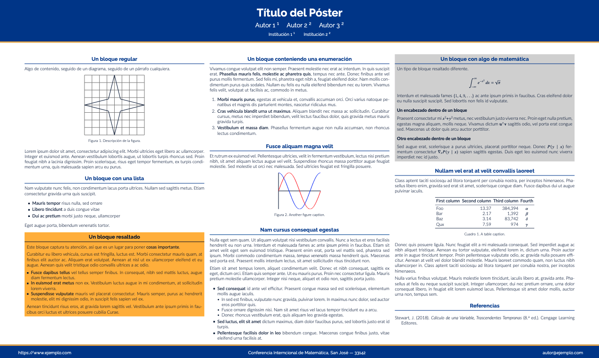

# Plantilla de Póster con Beamer Gemini para UNED

Este archivo `README.md` proporciona una guía rápida sobre cómo configurar y personalizar tu póster utilizando la plantilla de LaTeX basada en el tema Gemini y adaptada para la Universidad Estatal a Distancia (UNED).

## Configuración Inicial

1.  **Clase de Documento:** La plantilla utiliza la clase `beamer` para crear el póster.
    ```latex
    \documentclass[final]{beamer}
    ```
    * `final`: Esta opción optimiza la salida para la versión final. Si estás trabajando en un borrador, podrías cambiarla a `draft`.

2.  **Idioma:** Se ha configurado el soporte para el idioma español.
    ```latex
    \usepackage[T1]{fontenc}
    \usepackage[utf8]{luainputenc}
    \usepackage[spanish]{babel}
    ```
    * Si necesitas otro idioma, modifica la opción dentro de los corchetes en `\usepackage[spanish]{babel}`.

3.  **Dimensiones del Póster:** Define el tamaño físico de tu póster en centímetros.
    ```latex
    \usepackage[size=custom,width=120,height=72,scale=1.0]{beamerposter}
    ```
    * `width`: Ancho del póster en centímetros (actualmente 120 cm). Modifica este valor según tus necesidades.
    * `height`: Altura del póster en centímetros (actualmente 72 cm). Modifica este valor según tus necesidades.
    * `scale`: Factor de escala general. Puedes ajustarlo si necesitas hacer el contenido más grande o más pequeño.

## Tema y Colores

1.  **Tema:** Se utiliza una versión local del tema Gemini.
    ```latex
    \usetheme{temas/gemini}
    ```
    * Si deseas probar otros temas compatibles con Beamer, puedes cambiar la ruta y el nombre del tema aquí. No obstante, esta plantilla está optimizada para el tema Gemini.

2.  **Colores:** Se aplica una paleta de colores personalizada para la UNED.
    ```latex
    \usecolortheme{colores/uned}
    ```
    * El archivo con la paleta de colores de la UNED (`colores/uned.sty`) contiene las definiciones de los colores primarios y secundarios de la Universidad Estatal a Distancia. Si deseas modificar estos colores, edita directamente ese archivo. No obstante, lo más recomendable sería que crearas un nuevo tema con colores diferentes.
  
    
  
    No obstante, este proyecto también contiene un gran número de otros temas de colores que se pueden utilizar:

    * `brown` y `brown-minimal`
    * `gemini`
    * `labsix`
    * `mit`
    * `msu`
    * `stanford`
    * `umich`
    * `uned` (predeterminado en esta plantilla)

## Diseño del Contenido

1.  **Columnas y Separadores:** La plantilla está configurada para un diseño de múltiples columnas.
    ```latex
    \newlength{\sepwidth}
    \newlength{\colwidth}
    \setlength{\sepwidth}{0.025\paperwidth}
    \setlength{\colwidth}{0.3\paperwidth}
    ```
    * `\sepwidth`: Define el ancho del espacio entre las columnas (actualmente 2.5% del ancho total).
    * `\colwidth`: Define el ancho de cada columna (actualmente 30% del ancho total).
    * Para ajustar el número de columnas, deberás modificar estos valores asegurándote de que la suma total sea igual al ancho del papel (`\paperwidth`). La relación es: `(N+1)*\sepwidth + N*\colwidth = \paperwidth`, donde `N` es el número de columnas.

2.  **Número de Páginas y Columnas:** Especifica la estructura de tu póster.
    ```latex
    \newcommand{\paginas}{1}
    \newcommand{\columnas}{3}
    ```
    * `\paginas`: Define el número de páginas del póster (generalmente 1 para un póster).
    * `\columnas`: Define el número de columnas en cada página. Modifica este valor para cambiar la disposición de tu contenido.

3.  **Contenido de las Columnas:** El contenido de cada columna se incluye desde archivos externos.
    ```latex
    \IfFileExists{paginas/\i/col-\j.tex}{\include{paginas/\i/col-\j}}{}
    ```
    * La plantilla espera encontrar archivos de contenido para cada columna en la carpeta `paginas`. Si tienes un póster de una página y tres columnas, deberás crear los archivos `paginas/1/col-1.tex`, `paginas/1/col-2.tex`, y `paginas/1/col-3.tex` con el contenido de cada columna respectivamente.

## Información del Póster

1.  **Título, Autores e Instituciones:** Completa la información de tu póster.
    ```latex
    \title{Título del Póster}
    \author{Autor 1 \inst{1} \and Autor 2 \inst{2} \and Autor 3 \inst{2}}
    \institute[shortinst]{Institución 1 \inst{1} \samelineand Institución 2 \inst{2}}
    ```
    * Modifica el texto dentro de las llaves `{}` para reflejar el título, los autores y las instituciones de tu trabajo.
    * Utiliza `\inst{}` para indicar la afiliación de cada autor y `\samelineand` para separarlas en la misma línea si es necesario.

## Pie de Página (Opcional)

1.  **Información de Contacto y Evento:** Configura el contenido del pie de página si lo deseas.
    ```latex
    \footercontent{
        \href{[https://www.ejemplo.com](https://www.ejemplo.com)}{[https://www.ejemplo.com](https://www.ejemplo.com)} \hfill
        Conferencia Interncional de Matemática, San José --- 33142 \hfill
        \href{mailto:autor@ejemplo.com}{autor@ejemplo.com}}
    ```
    * Modifica las URLs, el nombre del evento, la ubicación y la dirección de correo electrónico según sea necesario.
    * `\hfill` se utiliza para espaciar los elementos del pie de página a los extremos.

## Logos (Opcional)

1.  **Encabezado con Logos:** Descomenta y configura las siguientes líneas para incluir logos en el encabezado.
    ```latex
    % Izquierda: institución
    %\logoleft{\includegraphics[scale=4.0]{logos/logo-white-text.png}}

    % Derecha: otras afiliaciones
    %\logoright{\includegraphics[height=7cm]{logos/NSF.eps}}
    ```
    * Descomenta la línea correspondiente (`%\logoleft` o `%\logoright`) eliminando el símbolo `%`.
    * Modifica la ruta al archivo de la imagen del logo y ajusta la escala o la altura según sea necesario. Asegúrate de que las imágenes de los logos estén en la carpeta `logos/` o especifica la ruta correcta.

Con esta información, deberías poder personalizar fácilmente esta plantilla de póster para tus presentaciones en la Universidad Estatal a Distancia utilizando el tema Gemini. ¡No dudes en consultar la documentación de Beamer y Gemini para opciones de personalización más avanzadas!
